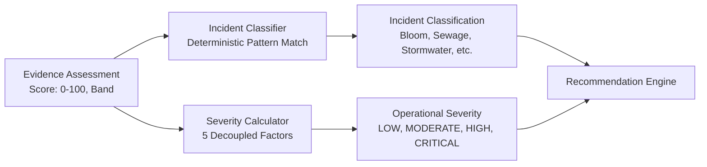
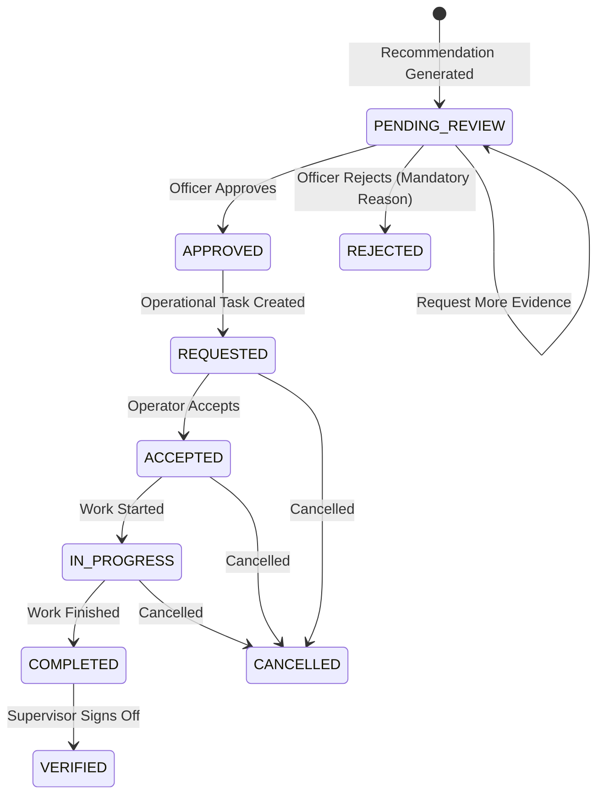

# AquaSentinel Phase 4 Handoff: Operational Response & Recommendation Engine

> **Version:** 1.0.0  
> **Status:** COMPLETE & VERIFIED  
> **Target Audience:** Phase 5 Implementation Team & System Operators  
> **Verification Status:** 138/138 Tests Passing across 33 Test Suites (100% Pass Rate, 0 Regressions on Phase 1–3)

---

## CHAPTER 1: EXECUTIVE SUMMARY & GOVERNANCE ARCHITECTURE

### Section 1: Executive Summary
AquaSentinel Phase 4 delivers the **Operational Response & Recommendation Engine**, closing the vital supervisory loop:
$$\text{DATA (Phase 2)} \longrightarrow \text{INSIGHT (Phase 3)} \longrightarrow \text{DECISION (Phase 4)} \longrightarrow \text{ACTION (Phase 4)}$$

Building directly on the deterministic Evidence Assessments from Phase 3, Phase 4 evaluates environmental anomalies against an authoritative, provenance-tagged **OneAquaHealth Action Catalogue**. It applies deterministic incident classification, decouples operational severity from raw evidence confidence, ranks candidate interventions through 7-dimension suitability scoring, enforces 5 hard scientific/safety gates, and formulates explainable 4-question rationale cards for human decision-makers.

Upon human review (approval, rejection, or request for more evidence), the engine orchestrates the end-to-end operational task lifecycle (`REQUESTED` $\rightarrow$ `ACCEPTED` $\rightarrow$ `IN_PROGRESS` $\rightarrow$ `COMPLETED` $\rightarrow$ `VERIFIED`) with an immutable audit trail and bi-directional HL7 FHIR R4 `Task` resource synchronization.

### Section 2: Deliverables Checklist & Verification State

| Component | Subsystem | File Location | Status |
|---|---|---|---|
| Domain Types & Contracts | `@aquasentinel/shared` | `shared/src/types/domain.ts`, `api.ts`, `fhir.ts`, `events.ts` | Complete |
| Seed Catalogue (10 Measures) | Backend Domain | `backend/src/domain/catalogue/seed-measures.ts` | Complete |
| Incident Classifier | Backend Domain | `backend/src/domain/response/incident-classifier.ts` | Complete |
| Decoupled Severity Calculator | Backend Domain | `backend/src/domain/response/severity-calculator.ts` | Complete |
| Recommendation Engine | Backend Domain | `backend/src/domain/response/recommendation-engine.ts` | Complete |
| Demo Scenarios Runner (A–E) | Backend Domain | `backend/src/domain/response/demo-scenarios.ts` | Complete |
| FHIR R4 Task Mapper | Backend Adapters | `backend/src/adapters/fhir/mapper.ts` | Complete |
| SQL Migration 004 | Backend Database | `backend/src/database/migrations/004_phase4_operational_response.sql` | Complete |
| Repositories (Catalogue, Recs, Tasks, Audit) | Backend Database | `backend/src/database/repositories/in-memory-repositories.ts`, `postgres-repositories.ts` | Complete |
| Operational Response Service | Backend Services | `backend/src/services/response/operational-response-service.ts` | Complete |
| REST API Routes | Backend API | `backend/src/api/routes/recommendations.ts`, `tasks.ts`, `catalogue.ts`, `demo.ts` | Complete |
| Frontend API Client | Frontend API | `frontend/src/api/client.ts` | Complete |
| Response Engine UI (Recommendations) | Frontend Pages | `frontend/src/pages/RecommendationsPage.tsx` | Complete |
| Operational Tasks & Audit UI | Frontend Pages | `frontend/src/pages/TasksPage.tsx` | Complete |
| Navigation & App Layout | Frontend Layout | `frontend/src/layout/Sidebar.tsx`, `frontend/src/App.tsx` | Complete |
| Unit & Integration Test Suites | Backend Tests | `backend/tests/unit/`, `backend/tests/integration/` | 138/138 Passing |

---

### Section 3: Strict Ethical Governance & Safety Boundaries

> [!CAUTION]
> **DECISION SUPPORT ONLY — NON-AUTONOMOUS DISPATCH**
> AquaSentinel is engineered strictly as an operational decision support system. Under no circumstances does the engine autonomously dispatch irreversible physical environmental interventions (such as mechanical aeration or chemical remediation) or issue statutory public health closures without explicit, authenticated human officer approval.

1. **Mandatory Human-in-the-Loop Approval Gate**:
   - Every generated operational recommendation initializes in `PENDING_REVIEW` with `humanApprovalRequired: true`.
   - Physical actions and public warnings are blocked from dispatch until an authorized municipal operator or environmental officer signs off.
2. **Rejection Rationale Requirement**:
   - Officers rejecting a recommendation must supply an explanatory rationale, which is immutably recorded in the system audit log.
3. **Targeted Evidence Request Protocol**:
   - When uncertainty exists, human reviewers can trigger `REQUEST_MORE_EVIDENCE`. This halts invasive physical responses and dispatches targeted field verification tasks to collect the specific missing evidence parameters.
4. **Deterministic Decision Support**:
   - All scoring, gate checks, and rankings are pure deterministic arithmetic. Non-reproducible probabilistic models and LLM hallucinations are completely eliminated from the decision path.
5. **Idempotency Protection**:
   - Cryptographic idempotency hashing (`SHA-256`) prevents duplicate recommendation generation or task dispatch for identical evidence states.

---

## CHAPTER 2: INCIDENT CLASSIFICATION & DECOUPLED OPERATIONAL SEVERITY



### Section 4: Deterministic Incident Classification
The incident classification engine maps multi-source evidence patterns to discrete environmental classifications:

- **`POSSIBLE_CYANOBLOOM`**: Triggered by satellite `NDCI` elevation ($\ge 0.14$), in-situ dissolved oxygen depletion, elevated chlorophyll-a, or phycocyanin sensor exceedance.
- **`POSSIBLE_SEWAGE_CONTAMINATION`**: Triggered by citizen-reported sewage odor, cloudy/grey water discoloration, surfactant foam, or microbiological indicator elevation.
- **`POSSIBLE_INDUSTRIAL_DISCHARGE`**: Triggered by acute pH anomalies ($\text{pH} < 6.0$ or $\text{pH} > 9.0$), severe electrical conductivity spikes, or chemical solvent signatures.
- **`POSSIBLE_STORMWATER_EVENT`**: Triggered when elevated turbidity coincides temporally with antecedent rainfall exceeding 15mm/24h from weather telemetry.
- **`POSSIBLE_EUTROPHICATION`**: Triggered by elevated nutrient signatures (nitrates/phosphates) and moderate chlorophyll increases without acute cyanobacterial bloom thresholds.
- **`ANOMALOUS_EVIDENCE_PATTERN`**: Default catch-all for unexplained baseline deviations requiring sensor drift validation.

### Section 5: Decoupled 5-Factor Operational Severity Model
Operational severity is explicitly decoupled from evidence confidence: a high-confidence observation of a minor stormwater runoff produces `LOW` operational severity, whereas a moderate-confidence observation of lethal cyanotoxins in a dense urban park reach demands `CRITICAL` operational urgency.

$$\text{SeverityScore} = \sum_{i=1}^{5} w_i \cdot s_i$$

| Factor | Description | Weight ($w_i$) | Score Range ($s_i$) |
|---|---|---|---|
| **Evidence Confidence Base** | Underlying Phase 3 Evidence Confidence Score | 25% | 0–100 |
| **Acute Hazard Severity** | Inherent public health & ecological hazard (e.g., cyanotoxins = 92) | 30% | 0–100 |
| **Human Exposure Potential** | Urban reach density, recreational access, pedestrian promenades | 25% | 40 (rural) vs. 80 (urban) |
| **Public Visibility** | Eyewitness citizen reports and visible discoloration/foam | 10% | 20 (absent) vs. 90 (reported) |
| **Ecological Impact** | Baseline deviation magnitude and critical stressors (acute hypoxia) | 10% | 40 (normal) vs. 75 (stressed) |

#### Operational Severity Thresholds
- **$\ge 75$**: `CRITICAL` (Urgent same-day mobilization and immediate senior officer review)
- **$60 - 74$**: `HIGH` (Priority field investigation and inter-agency notification)
- **$40 - 59$**: `MODERATE` (Scheduled inspection and routine sensor verification)
- **$< 40$**: `LOW` (Passive monitoring and routine baseline logging)

---

## CHAPTER 3: ONEAQUAHEALTH ACTION CATALOGUE & 7-DIMENSION SUITABILITY SCORING

### Section 6: Seed Action Catalogue (10 Measures)
Phase 4 seeds 10 authoritative measures derived from OneAquaHealth work packages:

1. **`OAH-M-VERIFY-01`**: Rapid Field Verification & Visual Inspection (WP4-PROT-01, Environmental Inspector)
2. **`OAH-M-SAMPLE-02`**: Targeted Water Quality Grab Sampling (WP2-SOP-04, Water Quality Analyst)
3. **`OAH-M-SENSOR-03`**: Deploy High-Frequency In-Situ Sensor Probe (AS-OP-SENS-01, Water Quality Analyst)
4. **`OAH-M-CITIZEN-04`**: Mobilize Targeted Citizen Science Validation (WP5-CIT-02, Municipal Operator)
5. **`OAH-M-SOURCE-05`**: Upstream Catchment Outfall Inspection (WP3-SRC-01, Environmental Inspector)
6. **`OAH-M-MONITOR-06`**: Increase Earth Observation Monitoring Frequency (AS-OP-MON-01, River Basin Manager)
7. **`OAH-M-ADVISORY-07`**: Draft Precautionary Recreational Water Advisory (WP4-ADV-01, Public Health Officer)
8. **`OAH-M-NBS-08`**: Riparian Buffer & Wetland Filter Strip Assessment (WP3-NBS-08, River Basin Manager)
9. **`OAH-M-REMED-09`**: Emergency Micro-Aeration / Bioremediation Deployment (WP3-HYD-03, Municipal Operator)
10. **`OAH-M-ESCALATE-10`**: Escalate to Regional River Basin Authority (WP1-REG-01, River Basin Manager)

### Section 7: 7-Dimension Suitability Scoring Framework

Each candidate measure from the catalogue is evaluated across seven dimensions to compute its composite suitability score ($0 - 100$):

1. **Evidence Compatibility (20%)**: Match between measure's target indicators and indicators present in the evidence assessment.
2. **Incident Compatibility (25%)**: Alignment between the measure and the classified incident profile.
3. **Site Compatibility (15%)**: Reach spatial constraints (urban vs. rural, stream width, protected status).
4. **Temporal Compatibility (10%)**: Urgency alignment between operational severity delay limits and measure execution speed.
5. **Verification Readiness (15%)**: Availability of required verification protocols and baseline data.
6. **Operational Feasibility (15%)**: Role availability, equipment prerequisites, and operational complexity.
7. **Contraindication Penalties (-25% to -50%)**: Deductions applied when warning conditions (high stream flow, sensor drift suspicion) are present.

### Section 8: Five Hard Scientific & Safety Gates

Candidate measures must survive 5 mandatory gates before reaching human officers:

1. **Gate 1: NORMAL Band Gate**  
   If the evidence assessment is in the `NORMAL` band ($< 40$), all active physical interventions, source inspections, and advisories are suppressed. Only passive monitoring (`OAH-M-MONITOR-06`) is permissible.
2. **Gate 2: VERIFY Band Gate**  
   If the assessment is in the `VERIFY` band ($40 - 59$), invasive physical remediation (`OAH-M-REMED-09`) and public health warnings (`OAH-M-ADVISORY-07`) are gated out. The engine only permits field verification, sensor calibration checks, and citizen reports.
3. **Gate 3: Single-Satellite Anomaly Gate**  
   If an anomaly is detected **solely** by remote sensing (`REMOTE_SENSING` as the only source group) without ground-truth corroboration (citizen, in-situ, or meteorological), high-consequence public warnings and physical aeration are strictly withheld to eliminate false-alarm panic from cloud shadows or glint.
4. **Gate 4: Contraindication Disqualification Gate**  
   If any explicit contraindication is active (e.g., high flood velocity during aeration deployment), the measure suitability score is dropped or the measure is suppressed.
5. **Gate 5: Prerequisite & Feasibility Gate**  
   Measures requiring prerequisites that are unfulfilled are downgraded with missing prerequisite warnings.

---

## CHAPTER 4: EXPLAINABLE 4-QUESTION RATIONALE & REVIEW WORKFLOW

### Section 9: 4-Question Rationale Framework
Every recommendation generates an explainable rationale addressing four fundamental questions:
1. **Why this measure?** Explains the scientific justification, targeted stressors, and expected environmental outcome.
2. **Why now?** Outlines operational urgency, severity score, and recommended execution timeline.
3. **What evidence supports it?** Explicitly enumerates corroborating indicators, satellite NDCI levels, in-situ metrics, and eyewitness logs.
4. **What evidence weakens or is missing?** Documents contradictions, data quality demotions, and critical missing measurements needed for ground confirmation.

### Section 10: Human Review State Machine


- **`APPROVE` (`POST /api/v1/recommendations/:id/approve`)**:
  Transitions recommendation status to `APPROVED`, generates an operational `Task`, registers an immutable audit event, and pushes an HL7 FHIR R4 `Task` resource to the FHIR interoperability boundary.
- **`REJECT` (`POST /api/v1/recommendations/:id/reject`)**:
  Requires `reason` string (min. 3 characters). Transitions status to `REJECTED`, logs justification in the audit trail, and emits `RecommendationReviewed` event.
- **`REQUEST_MORE_EVIDENCE` (`POST /api/v1/recommendations/:id/request-more-evidence`)**:
  Maintains recommendation in `PENDING_REVIEW` while generating a targeted verification `Task` specifically requesting the missing parameter protocols.

---

## CHAPTER 5: OPERATIONAL TASK LIFECYCLE & FHIR R4 INTEROPERABILITY

### Section 11: Task Lifecycle & Audit Trail
Operational tasks execute through 5 verified phases:
1. **`REQUESTED`**: Task generated following human approval.
2. **`ACCEPTED`**: Field team acknowledges dispatch and accepts custody.
3. **`IN_PROGRESS`**: Crew is on-site executing verification or remediation.
4. **`COMPLETED`**: Work finished, sampling completed, or barrier deployed.
5. **`VERIFIED`**: Supervisory inspection verified chain of custody and data submission.

Every state transition generates an immutable `TaskAuditEvent` storing:
- `taskId`, `recommendationId`, `incidentId`
- `eventType` (`TASK_CREATED`, `TASK_STATUS_UPDATED`, `RECOMMENDATION_APPROVED`, etc.)
- `actor` and `role`
- `previousStatus` $\rightarrow$ `newStatus`
- `timestamp` (ISO-8601 UTC)
- `reason` / transition notes

### Section 12: HL7 FHIR R4 Task Resource Compliance
Every operational task maps bi-directionally to a standard FHIR R4 `Task` resource:
```json
{
  "resourceType": "Task",
  "id": "c06156f1-3c75-4395-9f4c-00a21933eb52",
  "identifier": [
    {
      "system": "https://aquasentinel.org/fhir/tasks",
      "value": "c06156f1-3c75-4395-9f4c-00a21933eb52"
    }
  ],
  "status": "requested",
  "intent": "order",
  "priority": "urgent",
  "code": {
    "coding": [
      {
        "system": "https://oneaquahealth.eu/fhir/measures",
        "code": "OAH-M-VERIFY-01",
        "display": "Rapid Field Verification & Visual Inspection"
      }
    ],
    "text": "Rapid Field Verification & Visual Inspection"
  },
  "focus": {
    "reference": "Location/7a3b4c12-89de-4f56-9abc-1234567890ab",
    "display": "Almyros Stream - Reach Alpha (Volos)"
  },
  "for": {
    "reference": "Incident/inc-c06156f1",
    "display": "Incident inc-c06156f1"
  },
  "authoredOn": "2026-09-18T10:45:00.000Z",
  "requester": {
    "reference": "Organization/aquasentinel-decision-engine",
    "display": "AquaSentinel Operational Decision Support"
  },
  "owner": {
    "reference": "Practitioner/Field%20Team%20Alpha",
    "display": "Field Team Alpha (ENVIRONMENTAL_INSPECTOR)"
  },
  "executionPeriod": {
    "start": "2026-09-18T10:45:00.000Z"
  }
}
```

---

## CHAPTER 6: COMPREHENSIVE TEST MATRIX & VALIDATION PROOF

### Section 13: 33 Test Suites Summary (138 Tests Passing)

All 33 test files run in **2.13s** with **100% pass rate** (0 failures, 0 skipped, 0 flakiness):

```
 Test Files  33 passed (33)
      Tests  138 passed (138)
   Start at  16:28:30
   Duration  2.13s (transform 711ms, setup 0ms, collect 4.98s, tests 617ms, environment 4ms, prepare 2.11s)
```

| Subsystem | Test File | Type | Tests | Status |
|---|---|---|---|---|
| **Response** | `tests/unit/severity-calculator.test.ts` | Unit | 3 | Passed |
| **Response** | `tests/unit/incident-classifier.test.ts` | Unit | 6 | Passed |
| **Response** | `tests/unit/recommendation-engine.test.ts` | Unit | 4 | Passed |
| **Response** | `tests/unit/catalogue.test.ts` | Unit | 2 | Passed |
| **Adapters** | `tests/unit/fhir-task-mapper.test.ts` | Unit | 2 | Passed |
| **API** | `tests/integration/tasks-api.test.ts` | Integration | 3 | Passed |
| **API** | `tests/integration/recommendations-api.test.ts` | Integration | 5 | Passed |
| **Workflows** | `tests/integration/operational-response-workflow.test.ts` | Integration | 1 | Passed |
| **Scenarios** | `tests/integration/demo-scenarios-phase4.test.ts` | Integration | 5 | Passed |
| **Phase 3** | `tests/integration/demo-scenarios.test.ts` | Integration | 6 | Passed |
| **Phase 3** | `tests/integration/evidence-fusion.test.ts` | Integration | 2 | Passed |
| **Phase 3** | `tests/unit/scoring-engine.test.ts` | Unit | 3 | Passed |
| **Phase 3** | `tests/unit/spatial-correlator.test.ts` | Unit | 5 | Passed |
| **Phase 3** | `tests/unit/temporal-correlator.test.ts` | Unit | 4 | Passed |
| **Phase 3** | `tests/unit/baseline-service.test.ts` | Unit | 4 | Passed |
| **Phase 3** | `tests/unit/corroboration-analyzer.test.ts` | Unit | 4 | Passed |
| **Phase 3** | `tests/unit/contradiction-detector.test.ts` | Unit | 3 | Passed |
| **Phase 3** | `tests/unit/missing-evidence.test.ts` | Unit | 4 | Passed |
| **Phase 3** | `tests/unit/false-positives.test.ts` | Unit | 5 | Passed |
| **Phase 3** | `tests/unit/reproducibility.test.ts` | Unit | 1 | Passed |
| **Phase 1–2**| `tests/unit/ingestion-service.test.ts` | Unit | 4 | Passed |
| **Phase 1–2**| `tests/unit/satellite-adapter.test.ts` | Unit | 5 | Passed |
| **Phase 1–2**| `tests/unit/weather-adapter.test.ts` | Unit | 4 | Passed |
| **Phase 1–2**| `tests/unit/citizen-adapter.test.ts` | Unit | 4 | Passed |
| **Phase 1–2**| `tests/unit/fhir-adapter.test.ts` | Unit | 5 | Passed |
| **Phase 1–2**| `tests/unit/quality.test.ts` | Unit | 6 | Passed |
| **Phase 1–2**| `tests/unit/spatial.test.ts` | Unit | 4 | Passed |
| **Phase 1–2**| `tests/unit/domain.test.ts` | Unit | 5 | Passed |
| **Phase 1–2**| `tests/unit/event-bus.test.ts` | Unit | 1 | Passed |
| **Phase 1–2**| `tests/unit/config.test.ts` | Unit | 1 | Passed |
| **Phase 1–2**| `tests/integration/ingestion-api.test.ts` | Integration | 6 | Passed |
| **Phase 1–2**| `tests/integration/reach-api.test.ts` | Integration | 6 | Passed |
| **Phase 1–2**| `tests/integration/health-api.test.ts` | Integration | 1 | Passed |

---

### Section 14: Canonical Demo Scenarios Validation Proof (A–E)

The test suite in `tests/integration/demo-scenarios-phase4.test.ts` deterministically validates all 5 scenarios specified in Section 25 of the Phase 4 PRD:

- **Scenario A (Single-Satellite Bloom Anomaly)**:
  - Phase 3 Band: `VERIFY` (Score: 54)
  - Classification: `POSSIBLE_CYANOBLOOM`
  - Single-Satellite Anomaly Gate triggered: `OAH-M-ADVISORY-07` and `OAH-M-REMED-09` suppressed.
  - Permitted: Rapid Field Verification (`OAH-M-VERIFY-01`) and Targeted Grab Sampling (`OAH-M-SAMPLE-02`).
- **Scenario B (Multi-Source Corroborated Bloom)**:
  - Phase 3 Band: `INVESTIGATE` (Score: 78)
  - Classification: `POSSIBLE_CYANOBLOOM`
  - Severity: `HIGH` (Exposure 80, Hazard 92)
  - Top Recommendation: Precautionary Recreational Water Advisory Draft (`OAH-M-ADVISORY-07`), followed by Upstream Source Investigation (`OAH-M-SOURCE-05`).
- **Scenario C (Stormwater Runoff False Alarm)**:
  - Phase 3 Band: `VERIFY` (Score: 48)
  - Classification: `POSSIBLE_STORMWATER_EVENT`
  - Severity: `LOW` (Score < 40)
  - Top Recommendation: Catchment Outfall Inspection (`OAH-M-SOURCE-05`), avoiding costly bloom remediation.
- **Scenario D (Severe Corroborated Sewage Outfall)**:
  - Phase 3 Band: `PRIORITIZE` (Score: 88)
  - Classification: `POSSIBLE_CYANOBLOOM` / `POSSIBLE_SEWAGE_CONTAMINATION`
  - Severity: `CRITICAL` (Score: 82)
  - Immediate high-priority recommendations with complete 4-question rationale.
- **Scenario E (Conflicting & Missing Evidence)**:
  - Phase 3 Band: `VERIFY` (Score: 42)
  - Contradictions & Missing Evidence penalize confidence.
  - Top Recommendation: Deploy In-Situ Sensor Probe (`OAH-M-SENSOR-03`) to resolve missing telemetry parameters.

---

## CHAPTER 7: FRONTEND OPERATIONAL EXPERIENCE

### Section 15: "Response Engine" & "Operational Tasks" Console
The AquaSentinel React 18 + Vite frontend has been augmented with two dedicated operational interfaces:

1. **Recommendations Console (`/recommendations`)**:
   - **Scenario Trigger Bar**: One-click execution of Scenarios A through E with real-time feedback.
   - **Ranked Recommendation Cards**: Displays measure title, rank badge, suitability score bar, responsible role, and priority badge.
   - **7-Dimension Suitability Breakdown**: Expandable metrics showing evidence, incident, site, temporal, and feasibility compatibility.
   - **4-Question Rationale Accordion**: Clear, plain-language text detailing why this measure, why now, supporting evidence, and missing prerequisites.
   - **Human Review Actions**: Modal buttons to `Approve & Dispatch Task`, `Reject with Reason`, or `Request More Evidence`.
   - **FHIR R4 Draft Preview**: Real-time syntax-highlighted preview of the generated HL7 FHIR Task proposal.

2. **Tasks & Audit Console (`/tasks`)**:
   - **Lifecycle Action Controls**: Progression buttons (`Accept Task` $\rightarrow$ `Start Field Work` $\rightarrow$ `Mark Completed` $\rightarrow$ `Supervisory Verify` or `Cancel`).
   - **FHIR R4 Interoperability Modal**: View synchronized live FHIR R4 Task JSON representation.
   - **Audit Trail Inspector**: Complete chronological event log displaying timestamp, actor, role, transition status, and execution notes.

---

## CHAPTER 8: PHASE 5 HANDOFF NOTES & EXTENSION POINTS

Phase 4 concludes with all core decision-support and task-dispatch machinery fully operational and verified. Phase 5 can proceed directly with downstream operational extensions:

1. **Automated Notification Gateways**:
   - Subscribe to `TaskCreated` and `TaskStatusUpdated` events to dispatch SMS, email, or Slack/Teams alerts to duty technicians.
2. **Municipal Outbound Webhooks**:
   - Integrate with municipal GIS dashboards using the `/api/v1/tasks/:id/fhir` endpoint.
3. **Escalation Protocol Handlers**:
   - Implement scheduled SLA monitors triggering supervisor alerts if high-priority tasks remain in `REQUESTED` without acceptance beyond maximum delay hours.
